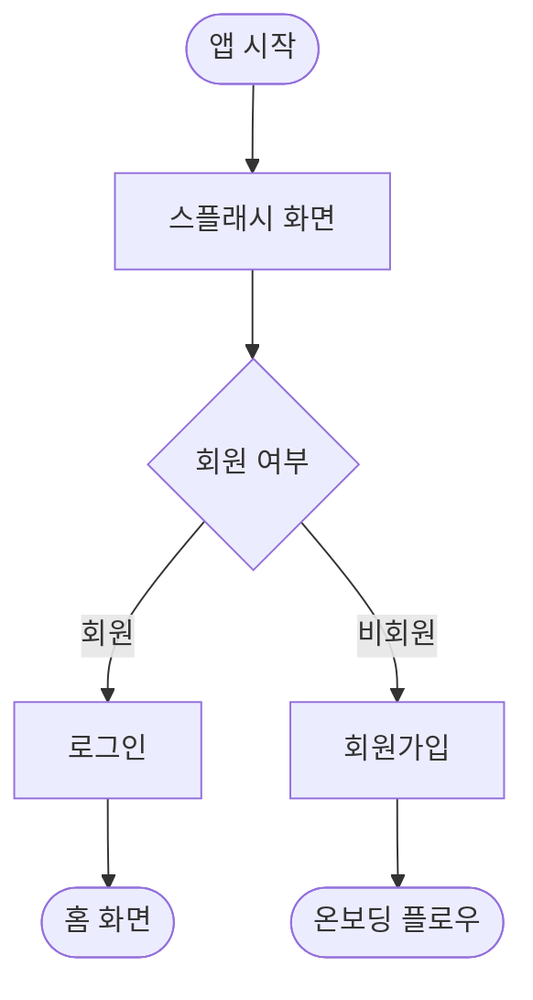
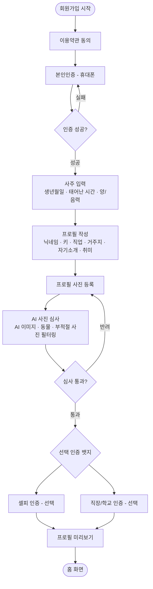
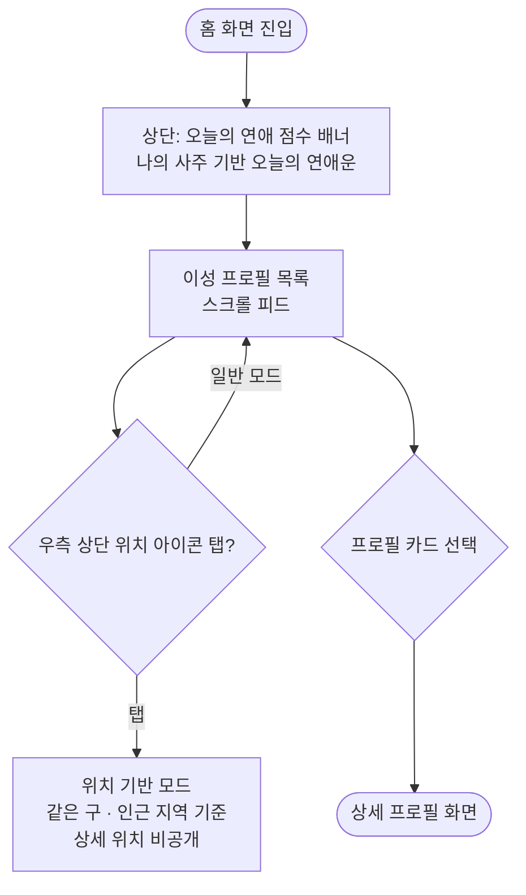
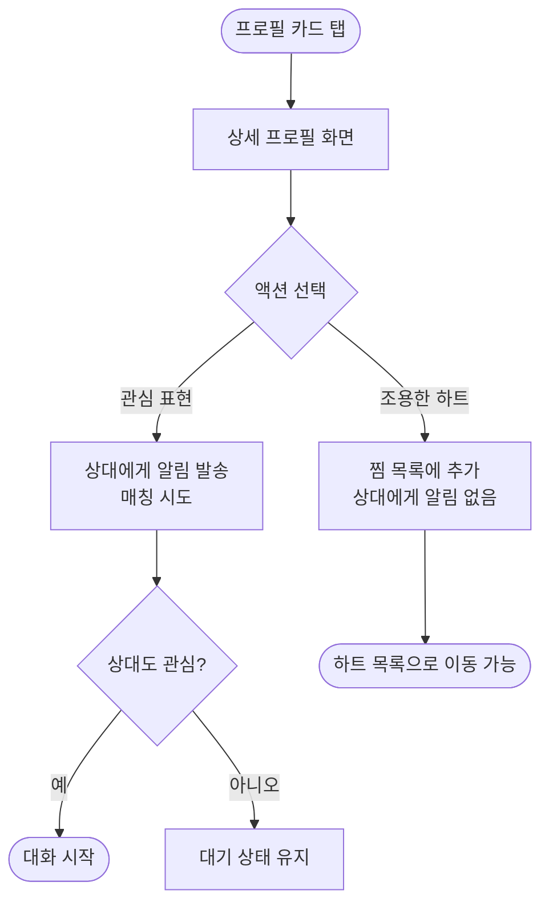
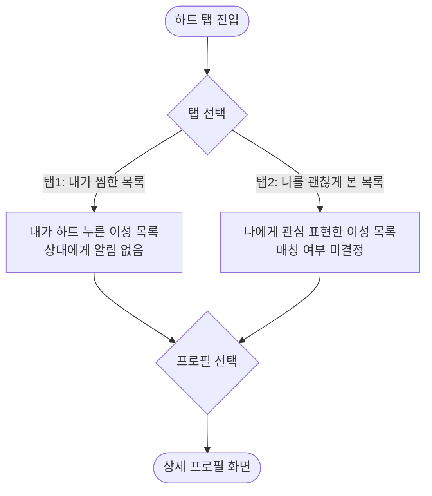
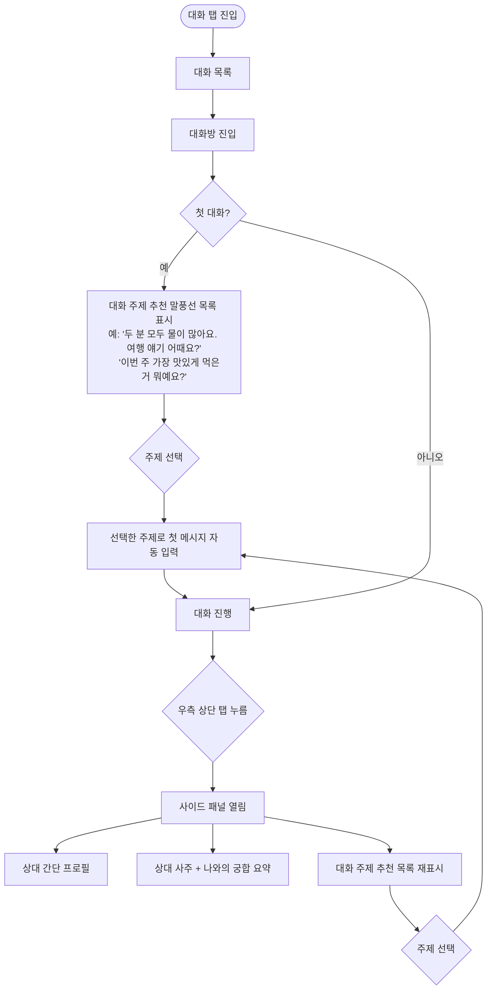
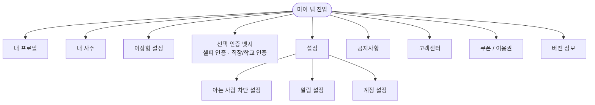

# 유온 (Yuon) 서비스 플로우차트 v2

브랜드 미션: 진짜 사람과, 이유 있는 만남을  
폰트: Pretendard | 컬러: Primary Teal #5AC7C4 / Accent Coral Peach #FF8C7D / Natural Warm Gray #9E9488

---

## 1. 진입 플로우 (Entry Flow)



---

## 2. 회원가입 · 온보딩 플로우 (Onboarding Flow)



### 온보딩 단계별 입력 항목

| 단계 | 항목 | 필수 여부 | 비고 |
|------|------|----------|------|
| 이용약관 동의 | 서비스 이용약관 · 개인정보 처리방침 · 위치 정보 동의 | 필수 | |
| 본인인증 | 휴대폰 번호 · 인증번호 | 필수 | 1인 1계정 |
| 사주 입력 | 생년월일 · 태어난 시간 · 양력/음력 | 필수 | 시간 모를 경우 미입력 가능 |
| 프로필 작성 | 닉네임 · 키 · 직업 · 거주지 · 자기소개 · 취미 | 필수 | |
| 프로필 사진 | 1장 이상 등록 | 필수 | AI 심사 자동 진행 |
| AI 사진 심사 | AI 생성 이미지 · 동물 · 부적절 사진 감지 | 자동 | 반려 시 재등록 |
| 셀피 인증 | 실시간 셀피 촬영 | 선택 | 뱃지 부여 |
| 직장/학교 인증 | 이메일 or 재직증명서 | 선택 | 뱃지 부여 |
| 프로필 미리보기 | 최종 확인 | 필수 | |

> 아는 사람 차단 설정은 **마이페이지 > 설정**에서 언제든 변경 가능

---

## 3. 홈 화면 (Home Screen)



### 홈 피드 프로필 카드 구성

```
┌─────────────────────────────┐
│  [프로필 사진 — 전체 배경]        │
│  ┌──────────┐  ┌──────────┐ │
│  │ 궁합 92점 │  │ 활동 5분전│ │
│  └──────────┘  └──────────┘ │
│                               │
│  "목화 일주, 서로 기운을 북돋아요" │  ← 사주 한 줄
│                               │
│  ✓ 본인인증  닉네임, 29         │  ← 인증마크 + 닉네임 + 나이
│  자기소개 한 줄이 여기 들어갑니다   │
└─────────────────────────────┘
```

| 요소 | 위치 | 내용 |
|------|------|------|
| 프로필 사진 | 카드 전체 배경 | 본인 등록 사진 |
| 궁합 점수 | 사진 위 좌측 | 숫자 + "점" (예: 92점) |
| 활동 시간 | 사진 위 우측 | "5분 전" · "오늘" · "이번 주" |
| 사주 한 줄 | 사진 위 하단 | 나와의 궁합 기반 한 줄 설명 |
| 인증 마크 | 닉네임 앞 | ✓ 본인인증 뱃지 |
| 닉네임 · 나이 | 카드 하단 | 닉네임, 29 |
| 자기소개 | 닉네임 아래 | 한 줄 표시 |

### 위치 기반 모드

- 상세 주소(동·번지) 비공개
- 표시 단위: **같은 구** · **인근 지역** · **서울 내** 수준
- 예시: "강남구" · "마포구" · "서울 서북권"
- 우측 상단 위치 아이콘 탭으로 모드 전환

---

## 4. 상세 프로필 화면 (Profile Detail Screen)



### 상세 프로필 화면 구성 요소

```
┌─────────────────────────────────┐
│  [프로필 사진 — 상단 대형]            │
│  닉네임  나이  ✓인증마크             │
│  음양오행 한 줄 소개                  │
├─────────────────────────────────┤
│  기본 정보                          │
│  · 거주지 (구 단위)                   │
│  · 키                              │
│  · 흡연 / 음주                       │
│  · 학교 / 직장 (인증 시 표시)           │
├─────────────────────────────────┤
│  사주 궁합 정보                       │
│  · 나와의 궁합 점수                    │
│  · 상생 포인트 설명                    │
│  · 사주 키워드 (예: 목화·수토금)         │
├─────────────────────────────────┤
│  첫인상 체크 (상대가 설정한 키워드)       │
│  예: 웃음이 많아요 · 차분해요 · 적극적이에요 │
├─────────────────────────────────┤
│  자기소개                            │
├─────────────────────────────────┤
│  취미 피드 (이미지 5~6장)              │
│  [이미지] [이미지] [이미지]              │
│  [이미지] [이미지]                    │
├─────────────────────────────────┤
│  [ 💛 찜하기 ]   [ 💚 관심 표현 ]      │
│  (상대 알림 없음)  (상대에게 알림 발송)   │
└─────────────────────────────────┘
```

| 섹션 | 항목 |
|------|------|
| 상단 | 프로필 사진 · 닉네임 · 나이 · 실물 인증 마크 · 음양오행 한 줄 소개 |
| 기본 정보 | 거주지 · 키 · 흡연/음주 · 학교/직장 인증 마크 |
| 사주 궁합 | 궁합 점수 · 상생 설명 · 사주 키워드 |
| 첫인상 체크 | 상대가 직접 설정한 성격 키워드 |
| 자기소개 | 본인 작성 소개글 |
| 취미 피드 | 이미지 5~6장 그리드 |
| 하단 버튼 | 찜하기(조용한 하트) / 관심 표현(알림 발송) |

---

## 5. 하단 탭바 (Bottom Navigation)

```
[ 🏠 홈 ]  [ 💛 하트 ]  [ 💬 대화 ]  [ 👤 마이 ]
```

| 탭 | 아이콘 | 기능 |
|------|------|------|
| 홈 | 집 모양 | 추천 피드 · 위치 기반 탐색 |
| 하트 | 하트 | 찜 목록 / 나를 괜찮게 본 목록 |
| 대화 | 말풍선 | 대화 목록 · 채팅 |
| 마이 | 사람 | 내 프로필 · 설정 |

---

## 6. 하트 메뉴 (Heart Menu)



| 탭 | 내용 | 상대 알림 |
|------|------|----------|
| 내가 찜한 목록 | 내가 하트 누른 이성 목록 (쇼핑몰 찜 방식) | 없음 |
| 나를 괜찮게 본 목록 | 나에게 관심 표현한 이성 목록 | — |

---

## 7. 대화 메뉴 (Chat Menu)



### 대화방 구성 요소

| 영역 | 내용 |
|------|------|
| 첫 진입 시 | 사주 기반 대화 주제 말풍선 3~5개 표시, 탭하면 해당 주제로 첫 메시지 입력 |
| 대화창 우측 상단 탭 | 사이드 패널 열림 |
| 사이드 패널 | 상대 간단 프로필 + 사주 궁합 요약 + 대화 주제 추천 목록 |
| 대화 주제 추천 | 두 사람의 사주 조합 기반, 자연스러운 대화 시작을 유도 |

---

## 8. 마이페이지 (My Page)



### 마이페이지 메뉴 구조

| 메뉴 | 하위 항목 |
|------|----------|
| 내 프로필 | 프로필 편집 · 사진 관리 |
| 내 사주 | 나의 사주 정보 확인 |
| 이상형 설정 | 나이 · 거주지 · 사주 궁합 조건 설정 |
| 선택 인증 뱃지 | 셀피 인증 · 직장/학교 인증 추가/관리 |
| 설정 | 아는 사람 차단 · 알림 설정 · 계정 관리 · 탈퇴 |
| 공지사항 | 서비스 공지 |
| 고객센터 | 문의 · FAQ |
| 쿠폰 / 이용권 | 쿠폰 등록 · 이용권 구매 |
| 버전 정보 | 앱 버전 · 업데이트 |

---

## 9. 전체 화면 구조 (Screen Architecture)

```
유온 앱
├── 진입
│   ├── 스플래시
│   └── 로그인 / 회원가입
│       ├── 이용약관 동의
│       ├── 본인인증 (휴대폰)
│       ├── 사주 입력
│       ├── 프로필 작성
│       ├── 프로필 사진 등록 + AI 심사
│       ├── 선택 인증 (셀피 / 직장·학교)
│       └── 프로필 미리보기
│
├── 홈 (하단 탭 1)
│   ├── 오늘의 연애 점수 배너
│   ├── 이성 프로필 피드
│   │   └── 상세 프로필
│   │       ├── 기본 정보
│   │       ├── 사주 궁합
│   │       ├── 취미 피드
│   │       ├── 찜하기 버튼 (조용한 하트)
│   │       └── 관심 표현 버튼 (알림 발송)
│   └── 위치 기반 모드 (우측 상단 아이콘)
│
├── 하트 (하단 탭 2)
│   ├── 탭 1: 내가 찜한 목록
│   └── 탭 2: 나를 괜찮게 본 목록
│
├── 대화 (하단 탭 3)
│   ├── 대화 목록
│   └── 대화방
│       ├── 첫 진입: 대화 주제 말풍선 추천
│       └── 사이드 패널 (우측 상단 탭)
│           ├── 상대 간단 프로필
│           ├── 사주 궁합 요약
│           └── 대화 주제 추천 목록
│
└── 마이 (하단 탭 4)
    ├── 내 프로필
    ├── 내 사주
    ├── 이상형 설정
    ├── 선택 인증 뱃지
    ├── 설정
    │   ├── 아는 사람 차단
    │   ├── 알림 설정
    │   └── 계정 관리
    ├── 공지사항
    ├── 고객센터
    ├── 쿠폰 / 이용권
    └── 버전 정보
```

---

## 10. 핵심 분기 정리 (Key Decision Points)

| 분기 지점 | 조건 | 결과 A | 결과 B |
|----------|------|--------|--------|
| 앱 첫 실행 | 회원 여부 | 로그인 → 홈 | 회원가입 → 온보딩 |
| 본인인증 | 인증 성공 여부 | 사주 입력으로 진행 | 재인증 요청 |
| AI 사진 심사 | 심사 통과 여부 | 다음 단계 진행 | 사진 재등록 요청 |
| 찜하기 | 버튼 종류 | 조용한 하트 (알림 없음) | 관심 표현 (상대 알림 발송) |
| 관심 표현 | 상호 관심 여부 | 매칭 → 대화 시작 | 대기 상태 유지 |
| 대화 첫 진입 | 첫 대화 여부 | 주제 추천 말풍선 표시 | 일반 대화창 |
| 사이드 패널 | 탭 여부 | 궁합 정보 + 주제 추천 표시 | 대화창 유지 |

---

*유온 플로우차트 v2.0 | 홈 이미지 레퍼런스 반영 · 가설 H1~H5 기반*
